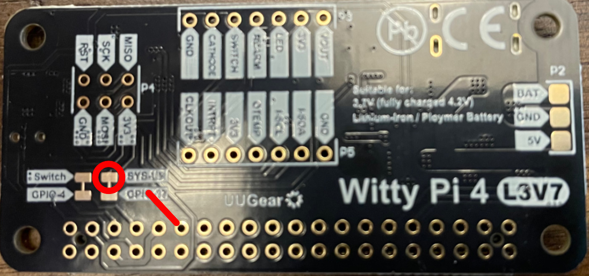

# pictureframe
An eink picture frame that automatically grabs photos from [PhotoPrism].

Hardware requirements:
* A [Raspberry Pi], _without_ headers - a [Zero 2 W] works
* Some [extra long headers]
* An [Inky Impression 13.3"]
* A [Witty Pi 4 L3V7]
* A compatible battery, such as this [LiIon 3.7V 6600mAh]

Skill requirements:
* Soldering: the header on the RPi.
* Some basic command line stuff.


## Raspberry Pi Setup
Using the [Raspberry Pi Imager], install the 64-bit Lite OS to an SD card. When
asked, select the button to "configure options":
* Hostname: I used `pictureframe`.
* Username: create a user and password
* Wireless: enter your wifi info - note the Zero 2 W only supports 2.4 GHz,
  _not_ 5 GHz.
* Enable SSH and add your public key, if you're using one.
* Disable telemetry.

When the Imager is done copying to the SD card, mount the card (if necessary)
and edit `bootfs/config.txt`:
```
# add these
dtparam=i2c1=on
dtparam=i2c_arm=on
dtoverlay=i2c1
dtoverlay=i2c1-pi5
dtoverlay=spi0-0cs

# some power-saving options
dtparam=audio=off
dtoverlay=disable-bt
camera_auto_detect=0
display_auto_detect=0

# comment out or remove
# dtoverlay=vc4-kms-v3d
```


## Hardware Setup
The Inky and Witty Pi both want to use pins 2, 3, 4, 5, 6, 14, and 17 (in BCM naming).
* Pins 2 and 3 are for the I2C interface, which is designed to support multiple
  devices as long as their I2C "address" does not clash. The Witty Pi uses I2C
  address 8, and, I forget the Inky's but I believe it's in the 60's. So, no
  trouble there.
* Pins 5 and 6 are used by the Inky for buttons A and B, respectively. This
  project doesn't use those buttons (or any buttons, really), so we aren't
  concerned about that.
* Additionally, the Inky doesn't really use pins 4 and 14 - it merely exposes
  those pins on a GPIO header. So that's fine.
* Pin 17 is the problem.
  * The Inky uses that to communicate when it is "busy". It's an inverted
    signal, so, a low state ("0") indicates busy and a high state ("1")
    indicates not busy.
  * The Witty Pi uses it to detect when the RPi has booted. The software that
    runs on the RPi "strobes" the pin twice (ie, raises then lowers) after
    boot.

Luckily, this isn't a difficult problem to solve. We're going to destroy the
trace for pin 17 on the back of the Witty Pi, solder a wire in its place, and
run that wire to pin 18, which is conveniently exposed by the Inky's GPIO
header on the back of the Inky.



In this picture of the back of the Witty Pi, the red line is a trace that
carries the signal from pin 17. Destroy this trace using an x-acto knife. Use a
multimeter to verify that there is no longer a connection between the pin and
the pad that is circled in red.

Next, solder a wire to the SYS-UP pad that is circled in red. The GPIO17 pad
below it is connected to the SYS-UP pad, so, you can solder the wire to both
pads, it's fine. This wire should be roughly 6 inches long. I used 22 AWG wire,
which was slightly too thin for the GPIO header on the Inky, but worked. From
the orientation of the photo above, the wire will connect to the Inky to the
left, so, the wire should go in that general direction.

While you have your soldering iron handy, solder the extra long header to the
RPi. If you purchased the same header as me, they're longer than you need, but
you can break them off to the right size.

Once everything is set, push the Witty Pi onto the RPi header as low as it will
comfortably go (the wire I soldered in the step above gets a little smushed by
the RPi's HDMI port, but that's ok). Then, push the RPi + Witty Pi onto the
Inky, being careful to not put any pressure on the Inky's screen. I stood the
Inky up on the side opposite the buttons and wiggled the RPi + Witty Pi into
the socket while being careful to only hold the Inky by the edges.

Finally, connect the wire we soldered to the Witty Pi to the "GP18" pin of the
GPIO header on the back of the Inky. I used a small piece of tape to hold the
wire in place since, as I mentioned above, the 22 AWG wire was a little thin
and felt like it wasn't going to stay in place on its own.

Connect the battery to the Witty Pi, and connect power to the Witty Pi's USB-C
port. Then, press the power switch on the side of the Witty Pi to boot.


## Software Setup
### Witty Pi
First, we'll install the Witty Pi software. Use ssh to connect to the RPi:
```bash
# as root, update and install git
sudo su -
apt update
apt install git

# grab the install script and run it
wget https://www.uugear.com/repo/WittyPi4/install.sh
./install.sh

# remove the install script
rm install.sh
```

The Witty Pi comes with a simple web-based interface, but we're not going to
use it. So, let's disable it:
```bash
# still as root
systemctl stop uwi
systemctl mask uwi
```

We also need to make a small edit to the Witty Pi's software to tell it that
we're using pin 18 instead of 17. Edit the file `/root/wittypi/utilities.sh`:
```bash
# find this line and change it from 17 to 18
readonly SYSUP_PIN=18
```

Now, let's do some basic configuration of the Witty Pi software:
```bash
# still as root
cd ~/wittypi
./wittyPi.sh
```

Ensure the option to "Auto-On when USB 5V is connected" is enabled. Then, enter
"11" to "View/change other settings" and ensure that "Default state when
powered" is set to "ON". The former option causes the Witty Pi to turn on the
RPi if a battery is connected, but then you also connect power to the USB-C
port. The latter option causes the Witty Pi to turn on the RPi when _any_ power
is first connected. THIS IS IMPORTANT.

The reason this is important is that the Witty Pi applies a small voltage to
the RPi's power rails (0.3V to the 5V rail, and 0.7V to the 3.3V rail) even
when in the "off" state. This seems to confuse the Inky, putting its controller
into some weird state that it can't get out of and nothing will work. By
enabling both of these options, we can cause the Witty Pi to turn on as soon as
power is applied, making the Inky happy. It took me _forever_ to figure this
out - it drove me nuts.

While we're here, I also set the "Pulsing interval during sleep" to the maximum
value (20) just to reduce the power draw.

At this point, you'll want to shutdown the RPi (`sudo poweroff`) and disconnect
both the USB-C _and_ the battery. Wait several seconds before reconnecting the
battery, and then the USB-C. It should boot immediately.


### PhotoPrism
Setting up [PhotoPrism] is beyond the scope of this document. The assumption is
that you're already running it.

Connect to the machine or docker container that is running PhotoPrism and run:
```bash
photoprism auth add --name pictureframe --expires -1 --scope "photos albums labels" admin
```

This will create an "app password" called "pictureframe" that never expires
(that's the `-1`) and has access to photos, albums, and labels for the "admin"
user. You can freely change the name or the user, just make sure that the user
you pick has access to the photos you want to display. You _probably_ only need
the "photos" scope, I'm not sure. Anyway, make note of the token this creates.


### Inky
Now we'll install the Inky software. This repo includes it as a submodule, so,
you need only clone this repo. Run these as your normal user, _not_ root!
```bash
# clone
cd ~
git clone --recurse-submodules https://github.com/bmatcuk/pictureframe.git

# Install inky software
# When asked to copy the examples, answer "no"
# When asked to install dependencies for examples, answer "no"
# When asked to generate documentation, answer "no"
cd ~/pictureframe/inky
./install.sh

# Install pictureframe dependencies
source ~/.virtualenvs/pimoroni/bin/activate
cd ~/pictureframe
pip3 install -r requirements.txt
```

Next, copy the `.env.example` file to `.env` and edit it to include the
PhotoPrism API key we created above. Also make sure the URL is correct.

Now, run the script:
```bash
cd ~/pictureframe
./pictureframe.py
```

The first time you run the script, it will download 5 images from PhotoPrism
and store them in the `images` directory but it _will not update the screen_!
That's normal. If this does not work, ensure that the url and token are correct
in your `.env` file. These images will be automatically resized to fit the
Inky's screen.

Once you successfully have the script downloading images from PhotoPrism, the
next time you run the script, it will actually update the Inky screen. Updating
the screen can take ~30s, so, while that's happening, the script will download
a new image, resize it, and save it to the `images` directory. After the screen
has finished updating, the image that was used will be deleted from the
`images` directory.


#### Troubleshooting
If the screen did not update, it might be because you skipped the step in the
Witty Pi setup to force the RPi to boot as soon as power is applied. A symptom
of this mistake is that if you run `gpio readall`, you'll see pin 10 ("MOSI")
is high ("1"), and pin 17 ("GPIO. 0") is low ("0").

If you're sure you haven't skipped anything, check that you didn't plug the RPi
in backward, or take the whole thing apart and check to make sure that you
successfully severed the pin 17 trace on the Witty Pi.

If everything looks good, I hate to say it, but: you're on your own. I spent
weeks messing with this thing - it's a fiddly setup. Good luck.


## Final Setup
Hopefully, at this point, you successfully have the script pulling images from
PhotoPrism and displaying them on the screen. Now we need to make that happen
automatically on boot, and configure the Witty Pi to automatically turn on and
off on a schedule.

As your user, create a file called `~/pictureframe.sh`:
```bash
#!/bin/bash

source ~/.virtualenvs/pimoroni/bin/activate
cd ~/pictureframe
./pictureframe.py
```

...and make it executable (`chmod +x pictureframe.sh`). This script will
activate the python environment and then run the `pictureframe.py` script.

Now, as _root_, create a file called `~/pictureframe.sh`:
```bash
source wittypi/utilities.sh

# update picture
sudo -H -u <USER> /home/<USER>/pictureframe.sh

# get voltage
if [ $(get_power_mode) -ne 0 ]; then
  vin=$(get_input_voltage)
  echo "Vin: $(printf %.02f $vin)V"
fi
```

...and make it executable (`chmod +x pictureframe.sh`). This script will run
the previous script as your user, and then output the voltage of the battery so
you can monitor how quickly it is depleting.

Now, still as root, edit the file `~/wittypi/afterStartup.sh` and add the
following:
```bash
# display an image
/root/pictureframe.sh

# shutdown the RPi
# this MUST end in a &
bash -c 'sleep 5; gpio -g mode 4 out' &
```

The Witty Pi software will run this script during boot, but before the Witty Pi
has fully finished configuring a couple of its own things. This script will run
the previous script, which will display an image and print the battery voltage,
then cause the RPi to shutdown. However, this is a little hacky. As I said, the
Witty Pi software runs this script before it has fully finished setting things
up. So, the last line runs a short bash script in the background (that `&` at
the end). This script waits 5 seconds for the rest of the Witty Pi software to
run, and then sets pin 4 as an output pin. Why does this cause the RPi to
shutdown? Because the Witty Pi signals that the RPi should shutdown by pulling
pin 4 low. By setting this to an output pin, it defaults to low, which the
Witty Pi software interprets as a shutdown command from the Witty Pi itself,
and it runs the shutdown procedure.

Seems hacky, but it's actually a recommended way to shutdown the RPi, according
to the Witty Pi documentation.

Now we need to make sure the Witty Pi has the right current time. Still as
root, run the following:
```bash
cd ~/wittypi
./wittyPi.sh
```

Select the option to "Synchronize with network time" and then select the option
to "Exit".

Then we need to create a schedule for the Witty Pi. Still as root, create the
file `~/wittypi/schedule.wpi` with the following content:
```
BEGIN 2025-10-25 04:00:00
END   2099-12-31 23:59:59
ON    M5
OFF   H11 M55
```

This script says: starting on Oct 25, 2025 (the date I wrote this, lol) at 4am,
and running until the end of the year 2099 (the highest year it will accept),
turn on the RPi for 5 minutes, and then turn it off for 11 hours and 55 minutes
in a loop. In other words, it will turn on at 4am and 4pm. Feel free to adjust
the script to suite your desire. The more often it turns on, the quicker your
battery will need recharged. I like twice a day because if it's more often than
that, chances are good I won't even notice.

Finally, still as root, run the following to set the first schedule:
```bash
cd ~/wittypi
./runScript.sh
```

The output will tell you the next time it will turn on the RPi. Note that this
time might be later than you expect - that's because the RPi is on _now_, which
is probably during a time that the schedule says it should have been OFF. So,
the Witty Pi software assumes that we must be in the next "ON" time already,
for some reason, so it schedules the next boot for the time after that. For
example, if you're using the same schedule as me above, and the current time is
6pm on Oct 25, 2025, the software is going to say, "huh, I'm supposed to be OFF
right now... we must be in the Oct 26th at 4am time slot. I'll schedule the
next boot for 4pm on Oct 26th then."

Now we can turn it off one last time using:
```bash
gpio -g mode 4 out
```

Feel free to disconnect the USB-C power whenever the battery has finished
charging (I believe the blue LED turns off). Keep an eye on it for the next
scheduled boot: it should, hopefully, turn on, display an image, grab a new
one, and shutdown all by itself.


## Building a Frame
I ordered a custom frame from a company called Frame Destination, specifically
[this
frame](https://www.framedestination.com/prod/frame/wood-frame-profile-865.html).
But, any frame with a "rabbet" of around an inch plus space for any glass
and/or matting that you're using will work. The "rabbet" is the depth of the
frame, from the back to the lip that holds in the glass in the front. This
particular frame has a rabbet of 1 3/8" - an inch for the electronics, a little
more than 1/8" for the glass and matting, and a little more than 1/8" of extra
space.

I ordered the matting to have an opening of 10 3/8" x 7 11/16" with a 1/8"
"overlap" (ie, actual dimensions of the opening are 10 1/8" x 7 7/16") and one
inch borders, making the total outside dimensions of the mat 12 3/8" x 9
11/16".

Now I needed a way to mount everything inside the frame.


[extra long headers]: https://www.amazon.com/dp/B07DJY6HT8?ref=ppx_yo2ov_dt_b_fed_asin_title&th=1
[Inky Impression 13.3"]: https://shop.pimoroni.com/products/inky-impression-7-3?variant=55186435277179
[LiIon 3.7V 6600mAh]: https://www.adafruit.com/product/353
[PhotoPrism]: https://www.photoprism.app/
[Raspberry Pi]: https://www.raspberrypi.com/
[Raspberry Pi Imager]: https://www.raspberrypi.com/software/
[Witty Pi 4 L3V7]: https://www.adafruit.com/product/5705
[Zero 2 W]: https://www.raspberrypi.com/products/raspberry-pi-zero-2-w/
